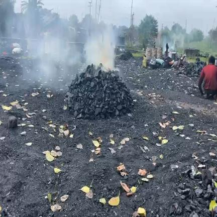
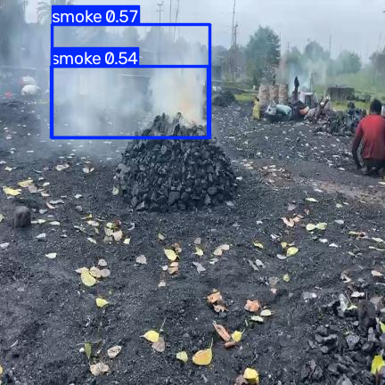
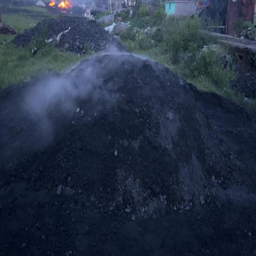
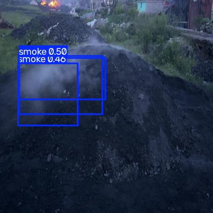
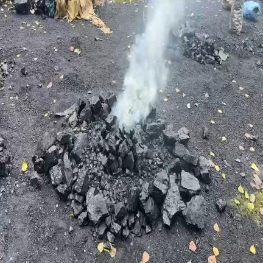
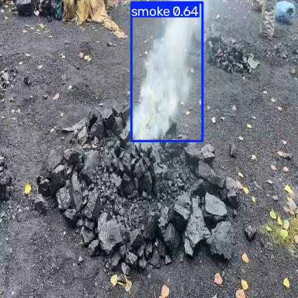

# Smoke Detection in Coal Combustion

YOLOv8 object detection for identifying and localizing smoke produced by spontaneous coal combustion. The model detects one class, `smoke`, and draws a bounding box around the detected region.

## Repository Contents

- `Model.ipynb`: local inference notebook for validation or custom images.
- `Smoke_Detection_in_Coal_Combustion.ipynb`: training, validation, and export notebook.
- `model/best.pt`: trained PyTorch YOLO model.
- `model/best.onnx`: exported ONNX model.
- `dataset/`: training, validation, and test images with YOLOv8 labels.
- `data.yaml`: YOLO dataset configuration.
- `presentation_images/`: example inputs and corresponding model outputs.
- `requirements.txt`: Python dependencies.

## Results

Recorded validation results from the training run:

| Metric | Score |
| --- | ---: |
| Precision | 0.8071 |
| Recall | 0.5116 |
| mAP50 | 0.6882 |
| mAP50-95 | 0.3856 |
| F1 score | 0.6263 |

These scores are reference results and may vary with a different environment, split, or training configuration.

## Installation

Use Python 3.9 or newer and install the dependencies from the repository root:

```bash
python -m venv .venv
source .venv/bin/activate       # macOS/Linux
# .venv\Scripts\activate       # Windows
python -m pip install -r requirements.txt
```

## Running Inference

The local inference notebook loads `model/best.pt`, selects an image from `dataset/valid/images`, runs prediction, and displays the annotated result.

```python
from IPython.display import display
from PIL import Image
from ultralytics import YOLO

model = YOLO("model/best.pt")
results = model.predict(source="dataset/valid/images/example.jpg", conf=0.25)

for result in results:
    annotated = result.plot()  # Ultralytics returns a BGR NumPy array.
    display(Image.fromarray(annotated[..., ::-1]))  # Convert BGR to RGB.
```

Replace `example.jpg` with an available image. Adjust the `conf` argument to change the confidence threshold.

## Input and Output Examples

The `presentation_images` directory shows how the model processes images:

| Input | Model output |
| --- | --- |
|  |  |
|  |  |
|  |  |

The input images show coal piles and visible smoke. The output images are the same scenes after inference, with blue boxes and confidence scores indicating regions classified as `smoke`. These examples make the model's behavior and output format easy to inspect.

## Dataset Collection and Preparation

The dataset was exported from Roboflow on August 6, 2026. It contains 254 images of spontaneous coal combustion, annotated in YOLOv8 format. The dataset is divided into `train`, `valid`, and `test` splits, with one class:

```yaml
nc: 1
names: ['smoke']
```

Roboflow applied the following preprocessing:

- Automatic image orientation with EXIF metadata removed.
- Stretch resize to `432x432` pixels.
- No image augmentation during dataset export.

The dataset configuration is recorded in [`data.yaml`](data.yaml), and the original export information is preserved in [`README.roboflow.txt`](README.roboflow.txt). The Roboflow project is private, so access to the source project may require permission from the dataset owner.

## Training and Validation

The training notebook fine-tunes YOLOv8 nano for 25 epochs and validates it against the dataset configuration:

```python
from ultralytics import YOLO

model = YOLO("yolov8n.pt")
model.train(data="data.yaml", epochs=25, imgsz=640)
metrics = model.val(data="data.yaml")
```

The notebook also exports the trained model to ONNX and saves a PyTorch state dictionary. For local inference, use the files in `model/` and `Model.ipynb`.

## Contributing

Contributions are welcome, including improvements to the notebooks, documentation, dataset tooling, evaluation, and deployment.

1. Fork this repository on GitHub.
2. Clone your fork and create a focused branch:

   ```bash
   git clone https://github.com/<your-user>/Smoke-Detection-in-Coal-Combustion.git
   cd Smoke-Detection-in-Coal-Combustion
   git checkout -b improve-documentation
   ```

3. Make and test your changes. For model changes, include the dataset/configuration used and relevant validation metrics.
4. Commit and push the branch to your fork:

   ```bash
   git add .
   git commit -m "Describe the change"
   git push origin improve-documentation
   ```

5. Open a pull request from your branch to this repository. Explain what changed, why it changed, how it was tested, and include screenshots or sample outputs when the change affects model behavior or documentation.

Please avoid committing private data, credentials, generated caches, or unnecessary model artifacts.

## License

This project is released under the [MIT License](LICENSE). The license permits use, copying, modification, distribution, sublicensing, and sale, provided that the copyright and permission notice are included. The software is provided without warranty.